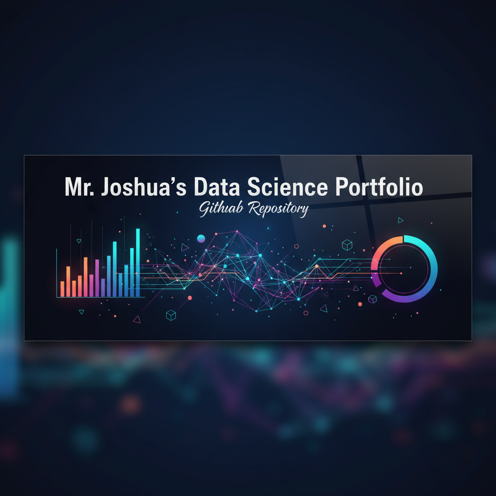

# Mr. Joshua's Data Science Portfolio

  

  <em>Turning Data Into Insight — Machine Learning • Time Series • Visualization</em>

  

---

### 🧠 About This Repository

This repository contains the source code for my personal data science portfolio website and the individual projects showcased within it. My goal is to demonstrate end-to-end project development, from data acquisition and processing to modeling and visualization.

---

### 📁 Featured Projects

Here is a selection of projects available in this repository.

| Project                               | Description                                                                                                                              | Live Demo / Output                                                                 | Source Code                                                                              |
| ------------------------------------- | ---------------------------------------------------------------------------------------------------------------------------------------- | ---------------------------------------------------------------------------------- | ---------------------------------------------------------------------------------------- |
| **Engineering Time Dashboard** | An interactive dashboard built with pure HTML, CSS, and JS to analyze an engineering team's time logs, featuring KPIs and dynamic SVG charts. | [**View Project**](https://github.com/Gift3dMyndZ/Data-Science-Projects/blob/main/dashboard.html) | [**View Code**](./dashboard.html) |
| --- | --- | --- | --- |
| **NLTK Sentiment Analyzer** | A tool that classifies text as positive, negative, or neutral using NLTK's VADER. Includes text preprocessing and result visualization. | [**View Project**](https://github.com/Gift3dMyndZ/Data-Science-Projects/tree/main/projects/NLTK-Sentiment-Analyzer/) | [**View Code**](./NLTK-Sentiment-Analyzer/) |
| **Automated Weather ETL Pipeline** | An automated ETL pipeline that fetches, cleans, and loads daily weather data from the OpenWeatherMap API using Python and Pandas. | [**View Project**](https://github.com/Gift3dMyndZ/Data-Science-Projects/tree/main/projects/automated-weather-etl/) | [**View Code**](./weather_etl/) |
| **Stock Price Prediction (LSTM)** | A deep learning model using an LSTM network to forecast stock price trends based on historical Yahoo Finance data. | [**View Project**](https://github.com/Gift3dMyndZ/Data-Science-Projects/tree/main/projects/stock-price-prediction-lstm/) | [**View Code**](./stock-price-prediction/) |                                        |

---

### 🧰 Tech Stack & Tools

A quick look at the technologies I use across these projects.

  
  
  
  
  
  
  
  
  

---

Feel free to explore the project folders to see the underlying code. If you have any questions, don't hesitate to reach out!